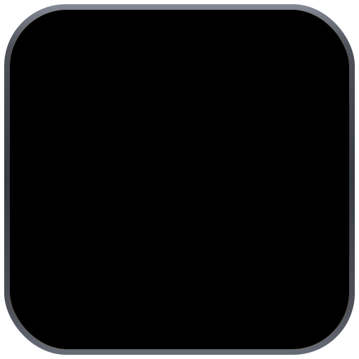
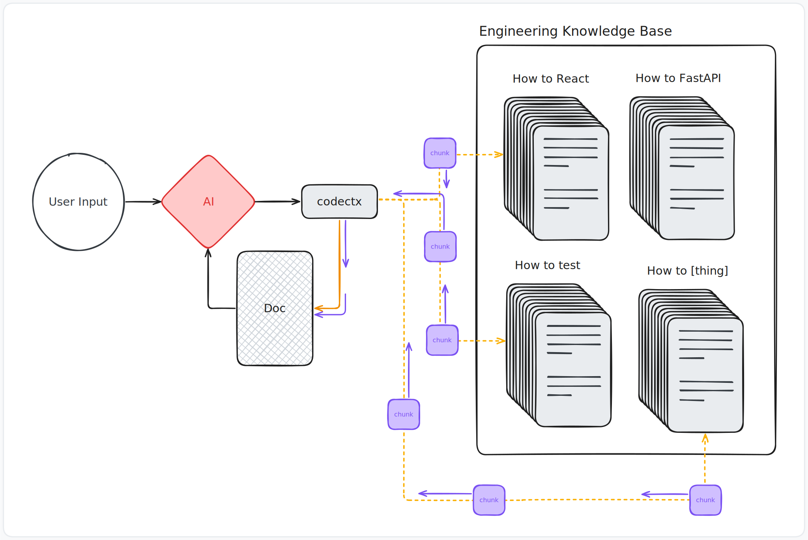

<p align="center">
  
</p>

<h1 align="center">codectx</h1>

<p align="center">
  The package manager for AI code documentation.
</p>

<p align="center">
  <picture>
    <source media="(prefers-color-scheme: dark)" srcset=".assets/knowledge-base-diagram.dark.svg">
    <source media="(prefers-color-scheme: light)" srcset=".assets/knowledge-base-diagram.light.svg">
    
  </picture>
</p>

---

For a full overview of what codectx does and how it works, see the
[product overview](docs/product/README.md).

## Install

**Shell (Linux / macOS):**

```bash
curl -fsSL https://raw.githubusercontent.com/securacore/codectx/main/bin/install | sh
```

**Go:**

```bash
go install github.com/securacore/codectx@latest
```

Binaries are published for Linux and macOS on `amd64` and `arm64`.
The install script detects your architecture, downloads the correct
binary, and verifies its SHA256 checksum. Set `INSTALL_DIR` to
override the install location.

## Usage

```bash
codectx new my-project     # Scaffold a new documentation package
codectx add react@org      # Install a package from GitHub
codectx compile            # Compile all packages into .codectx/
codectx link               # Symlink compiled output to tool-specific files
codectx search react       # Search the registry for packages
codectx watch              # Watch for changes and recompile automatically
codectx version            # Print the installed version
```

The `codectx-` prefix is always implied. When you type `react@org`,
the CLI resolves it to `codectx-react` owned by `org` on GitHub.

## Development

### Prerequisites

- [devbox](https://www.jetify.com/devbox)
- [just](https://github.com/casey/just)

### Setup

```bash
just install
```

This installs devbox packages (Go, Docker, golangci-lint, lefthook),
runs `go mod download`, and installs git hooks via lefthook.

### Running the CLI

All arguments are forwarded into the Docker container:

```bash
just codectx compile
just codectx search react
```

Or connect to the container directly:

```bash
just connect
```

### Testing

```bash
go test ./... -count=1
```

### Linting

```bash
golangci-lint run ./...
```

Both run automatically on pre-commit via lefthook.

### Commands

```bash
just          # List all available commands
just docker   # List Docker-specific commands
```

## Releasing

Releases are created by pushing a semver tag, which triggers a GitHub
Actions workflow that runs tests and lint before building binaries for
all platforms via GoReleaser.

```bash
bin/release          # Bump patch version (v0.1.0 -> v0.1.1)
bin/release minor    # Bump minor version (v0.1.0 -> v0.2.0)
bin/release major    # Bump major version (v0.1.0 -> v1.0.0)
```

The script requires a clean working tree on the `main` branch,
confirms the version bump, then pushes the tag to trigger the pipeline.

### Release Pipeline

1. Tag push triggers `.github/workflows/release.yml`
2. Tests and lint run first as a gate
3. GoReleaser builds `linux/amd64`, `linux/arm64`, `darwin/amd64`,
   `darwin/arm64` binaries with version injected via ldflags
4. GitHub Release is created with tarballs and SHA256 checksums

### Secrets Required

| Secret | Purpose |
|---|---|
| `GITHUB_TOKEN` | Automatic, used by GoReleaser to create releases |

## Update Notifications

The CLI checks for newer versions in the background (once per 24 hours)
and displays a message after command output when an update is available.
This check never blocks command execution.

Disable with:

```bash
export CODECTX_NO_UPDATE_CHECK=1
```
